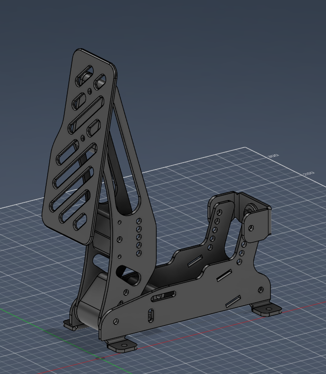
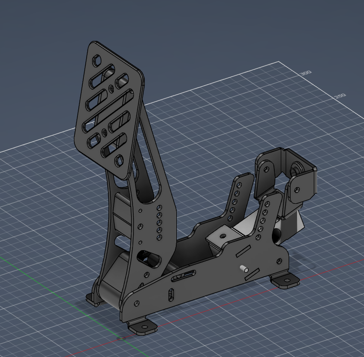
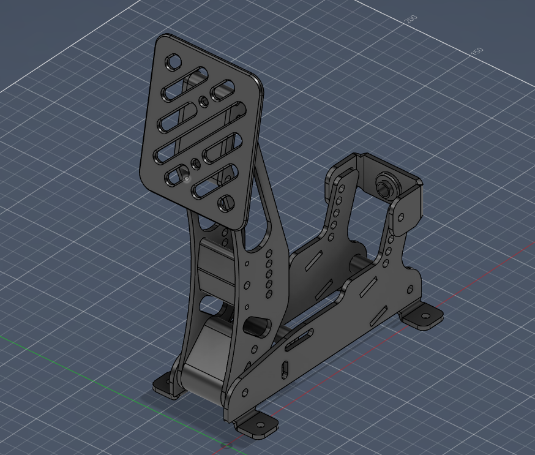
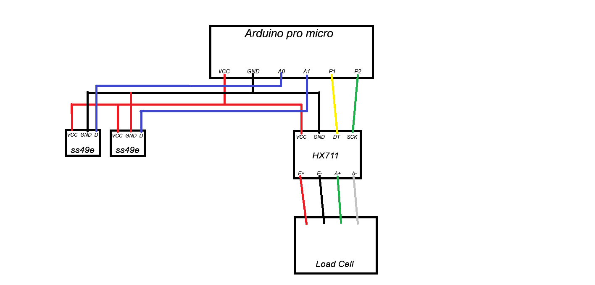

# SimPedals
Simple DIY simulator pedals to use on my pc.

it's pretty simple how they work, The brake pedal uses a load cell as an input to get a better feeling and the accelerator and clutch use ss49e hall sensors to get the input value. The pedal's body are made out of 304 stainless steel and to get the feedback  they use dyecast springs and skateboard bushings for the brake. Everything will be contrtolled via custom software on an arduino pro micro.

Accelerator pedal:

Brake pedal:

Clutch pedal:

Electrical scheme:
